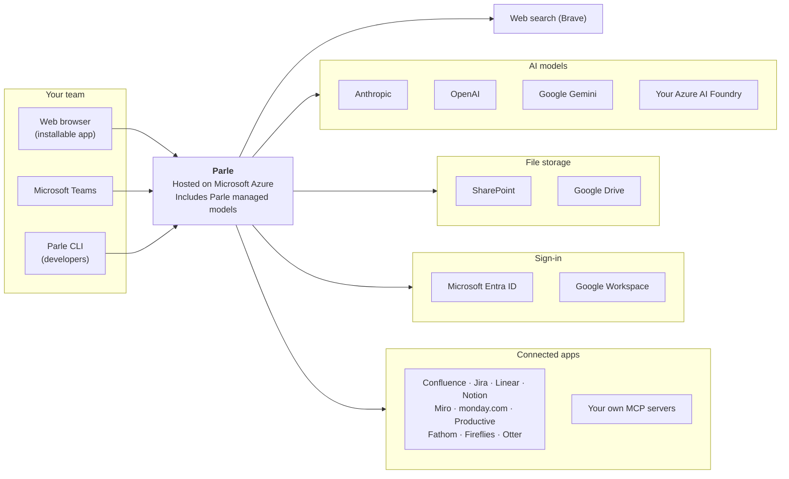

Parle is a hosted service. Your team uses it from a browser, from Microsoft Teams or from the command line, and Parle connects outward to the AI models, file storage and business systems your organization chooses. There is nothing to install on your servers.

## How your team reaches Parle

<CardGroup cols={3}>
  <Card title="Web app" icon="browser">
    Parle runs in any modern browser and can be installed as an app on desktop and mobile. All of your work happens here.
  </Card>
  <Card title="Microsoft Teams" icon="microsoft">
    Mention Parle in a Teams channel linked to a project, and the question becomes a conversation in that project, with the same budgets and rules as the web app.
  </Card>
  <Card title="Parle CLI" icon="terminal">
    A small command-line tool developers use to sign in and connect their AI coding tool to a project for usage tracking.
  </Card>
</CardGroup>

Every route arrives at the same service and is checked in the same way: who you are, which organization you belong to, and what your role allows in that project.

## Where Parle runs

Parle is a software-as-a-service product **hosted on Microsoft Azure**. We operate the whole platform, so you don't deploy, patch or scale anything.

- **Your organization's data is kept separate.** Every organization is isolated from every other: conversations, files, members and usage are scoped to your organization.
- **Secrets stay server-side.** Provider API keys and integration credentials are stored in a dedicated secrets vault and used only by the Parle service when it makes a call. They are never sent to a browser.
- **Parle managed models run inside Parle's own Azure environment.** If your organization uses Parle's managed models rather than its own keys, your conversations go to models hosted within Parle's Azure environment, not to a separate AI company.

## What Parle connects to

Parle connects outward only to the services your organization has set up or switched on. For each one, see who it is for and whose credential is used in [Connected Services](/architecture/connected-services).

| Category | Services | Whose credential |
|---|---|---|
| **AI models** | Anthropic, OpenAI, Google Gemini, your own Azure AI Foundry, or Parle managed models | Yours (bring your own key), or Parle's for managed models |
| **File storage** | Parle storage, SharePoint, Google Drive | Parle's for Parle storage; access you grant for SharePoint and Drive |
| **Sign-in** | Email and password, Microsoft Entra ID, Google Workspace | Parle's own sign-in, or your identity provider |
| **Connected apps** | Confluence, Jira, Linear, Notion, Miro, monday.com, Productive, Fathom, Fireflies, Otter, and any MCP server you register | The organization's, the project's or each user's own connection |
| **Web search** | Brave, only if you switch Web Search on | Parle's |

<Note>
  Parle does not use your content to train AI models, and it does not sell your data.
</Note>

## Related

- [Connected Services](/architecture/connected-services): the full list, with what each one receives
- [Security and Compliance Overview](/security/overview)
- [Plans & Billing](/plans-and-billing): which plans include each connection
